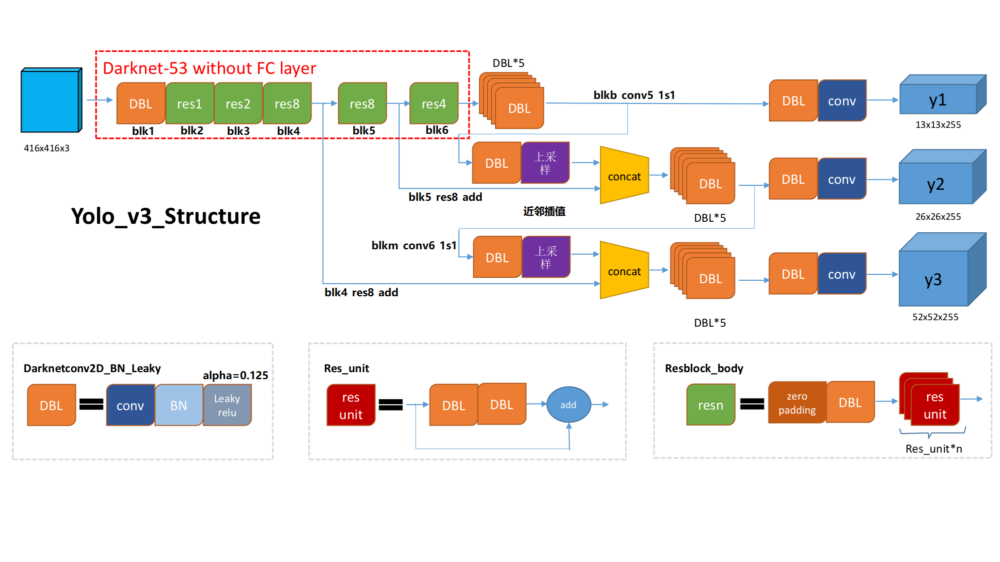
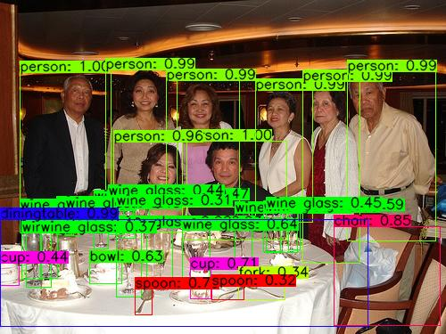

# YOLOv3 quantization(offline) model v1.0

This repository is YOLOv3 quantization model vertion1.0, include  pretrain code on ImageNet, inference with one image as input and save the quantization parameters of inputs,activations,origins,weights and biases of each layer.



## Prerequisites

- Python environment (>=2.7) for 64 bits windows or Linux

- tensorflow-gpu==1.12.0, To run TensorFlow on your GPU as we and most people do, you'll need to follow the [directions](https://www.tensorflow.org/install/install_windows) for installing CUDA and CuDNN. We recommend setting aside at least an hour to make sure you do this right.

- other python library: numpy, opencv-python, PIL, easydict, math,absl

- hardware environment: NVIDIA Geforce GTX 1080Ti

  

## Document

- The file fold contains the core codes of this repository, if you need to change the  CNN structure, just modify the backbone in darknet53.py

```
|--core
|  |--config.py          // definite global hyper-parameter
|  |--darknet53.py       // build the backbone of YOLOv3
|  |--nn_skeleton.py     // CNN library, definite all the model
|  |--save_parameters.py // save the paramenters of each layer
|  |--utils.py           // image preprocess and postprocess
|  |--YOLOv3.py          // build the integrate struture
```

-  This file fold provides the input image , anchor size and the information for image post-processing

```
|--data
|  |--plusAI
|  |  |--baselines.txt     // general anchor size 
|  |  |--coco.names        // classfication numbers of MS COCO dataset 
|  |  |--layer_name.txt    // YOLOv3 layer names
|  |  |--test.jpg
|  |  |--test_1024x772.jpg
|  |  |--result.jpg
|  |  |--YOLO_v1.2.xlxs    // YOLOv3 structure details 
```

- Others

```
|--dataset
|  |--ImageNet.py           // the library to load the imagenet data       
|--log
|  |--checkpoint_imagenet   // the ckpt save path of pretraining on imagenet 
|  |--checkpoint_transfer   // the ckpt path of YOLOv3 inference
|--debug.py                 // for debug 
|--pretrain_on_ImageNet.py  // pretrain code on ImageNet dataset
|--quant_YOLO.py            // YOLOv3 inference
```

## Instructions

1. Clone this repository.

2. pip install the library which are required.

3. run the pretrain code on ImageNet

   ```
   python pretrain_ImageNet.py --gpu=0,1,2,3
   ```

4.  run the YOLOv3 inference

   ```
   python quant_YOLO.py --gpu=0,1
   ```



## Acknowledgement

1. YunYang1994/YOLO v3: https://github.com/YunYang1994/tensorflow-yolov
2. XJTUWYD/ShuffleDet: <https://github.com/XJTUWYD/ShuffleDet>
3. BichenWuUCB/squeezeDet: <https://github.com/BichenWuUCB/squeezeDet>

## Reference

1. YOLOv3: An Incremental Improvement
2. Quantizing deep convolutional networks for efficient inference: A whitepaper
3. Quantization and Training of Neural Networks for Efficient Integer-Arithmetic-Only Inference
4. Must Know tips/tricks in Deep Neural Networks (by Xiu-Shen Wei)


